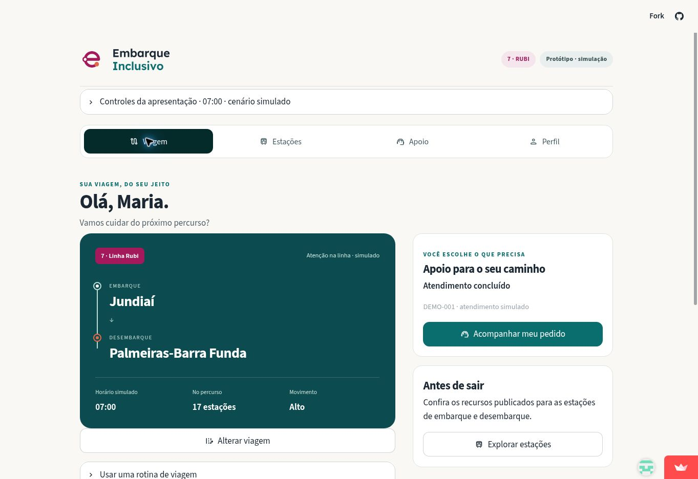

# Embarque Inclusivo

Projeto acadêmico concluído, desenvolvido no contexto do **Hacktown**, voltado ao empreendedorismo, por três estudantes da **Universidade Presbiteriana Mackenzie**.

O grupo criou um protótipo de aplicativo de mobilidade inclusiva para a Linha 7–Rubi, reunindo informações sobre estações, rotinas do passageiro e pedidos de apoio, com atenção às pessoas com deficiência ou mobilidade reduzida.

[Abrir a demonstração](https://hackathon-embarque-inclusivo-v8jpnvffi5zdyn4btewhay.streamlit.app/)



## Sumário

1. [Contexto, equipe e proposta](#1-contexto-equipe-e-proposta)
2. [Funcionalidades implementadas](#2-funcionalidades-implementadas)
3. [Como executar](#3-como-executar)
4. [Cenários de apresentação](#4-cenários-de-apresentação)
5. [Dados e arquitetura](#5-dados-e-arquitetura)
6. [Limites da demonstração](#6-limites-da-demonstração)
7. [Verificação e apresentação](#7-verificação-e-apresentação)

## 1. Contexto, equipe e proposta

### 1.1. Contexto acadêmico e resultado

O Embarque Inclusivo foi elaborado como exercício de empreendedorismo no Hacktown, relacionando a identificação de um problema social, a construção de uma proposta de negócio e o desenvolvimento de um protótipo demonstrável.

O projeto foi classificado para a segunda fase com **nota 7,4**. Entretanto, dificuldades logísticas impediram a participação do grupo na apresentação dessa etapa, que seria presencial. O ciclo acadêmico foi encerrado, e este repositório preserva o trabalho desenvolvido e seus resultados como registro acadêmico e de portfólio.

### 1.2. Equipe e contribuições

A equipe foi formada por três estudantes da Universidade Presbiteriana Mackenzie, com contribuições complementares na concepção, execução e apresentação visual da proposta.

| Integrante | Curso | Contribuição |
|---|---|---|
| Marcos Vinicius Vieira dos Santos | Análise e Desenvolvimento de Sistemas | Coidealização da proposta e responsabilidade integral pela implementação técnica e pela documentação, incluindo o desenvolvimento do protótipo e a estruturação dos dados de demonstração. |
| Karla Priscila Oliveira Silva | Matemática | Participação na idealização e na construção da proposta do projeto. |
| Gabriela Cristina Vieira | Marketing | Criação da identidade visual do Embarque Inclusivo. |

### 1.3. Problema e proposta de negócio

Informações dispersas sobre acessibilidade e assistência dificultam o planejamento da viagem e aumentam a dependência de terceiros. O Embarque Inclusivo relaciona o percurso às necessidades de cada pessoa e torna as etapas de um pedido de apoio mais claras.

A proposta de negócio B2B, voltada a operadoras de trens e metrôs, foi desenvolvida no âmbito desse exercício acadêmico. A Linha 7–Rubi foi o recorte escolhido para a demonstração; não há parceria ou integração confirmada com a TIC Trens. O MVP foi construído para demonstrar a ideia em diferentes situações de viagem e apoiar sua apresentação.

## 2. Funcionalidades implementadas

- **Entrada:** escolha entre seis pessoas fictícias ou crie um perfil temporário, sem senha ou diagnóstico.
- **Viagem:** consulte a rotina cadastrada, altere origem e destino, escolha ida ou retorno e explore o percurso.
- **Estações:** busque uma das 17 estações e consulte recursos publicados, endereço e fonte.
- **Apoio:** solicite assistência e simule confirmação, conclusão ou cancelamento.
- **Perfil:** ajuste necessidades, preferência de comunicação, rotina, tamanho do texto e contraste.
- **Apresentação:** alterne quatro cenários, explore as 24 horas e reinicie a demonstração.

A identidade visual utiliza as logos originais da equipe, com verde petróleo, rubi, coral e fundo claro. A interface adapta as colunas a telas menores e mantém controles nativos do Streamlit, foco visível e mensagens com texto além das cores.

## 3. Como executar

Recomendado: Python 3.12 ou superior. Na raiz do repositório:

```bash
python -m venv .venv
```

Ative o ambiente virtual no seu sistema operacional. Depois:

```bash
python -m pip install -r requirements.txt
python -m streamlit run app/src/streamlit_app.py
```

No Streamlit Community Cloud, configure `app/src/streamlit_app.py` como arquivo principal na branch `main`. Os CSVs e as imagens já estão no repositório; não são necessárias credenciais.

## 4. Cenários de apresentação

| Cenário | Hora simulada | Comportamento |
|---|---|---|
| Viagem tranquila | 10h | Baixo movimento, sem ocorrência programada. |
| Movimento moderado | 14h | Movimento moderado, sem ocorrência programada. |
| Horário de pico | 7h | Movimento alto e orientação conforme as preferências. |
| Pico com ocorrência | 7h | Movimento alto e restrição em Vila Aurora, Perus e Caieiras. |

O último cenário combina a ocorrência sintética cadastrada às 13h com o pico das 7h, sem alterar o CSV original. Assim, é possível comparar a mesma viagem com e sem ocorrência. O aviso indica se o trecho afetado pertence ao percurso selecionado.

**Escolher horário** usa diretamente os 24 registros horários. Na entrada, o app usa a hora de saída da rotina; os minutos são agrupados na respectiva hora da simulação. Os horários e níveis de movimento não representam monitoramento real.

## 5. Dados e arquitetura

| Arquivo | Responsabilidade |
|---|---|
| `app/src/streamlit_app.py` | Telas, navegação, formulários e estado da sessão. |
| `app/src/data_access.py` | Leitura dos CSVs e ligação entre usuários, rotinas e viagens. |
| `app/src/journey.py` | Percursos, cenários e transições da assistência. |
| `app/src/ui.py` e `style.css` | Componentes visuais e estilos. |
| `.streamlit/config.toml` | Tema nativo do Streamlit. |
| `data/estacoes_linha7.csv` | Cadastro estático de referência. |
| `data/simulados/` | Seis usuários, oito rotinas, 16 trechos e 24 registros operacionais sintéticos. |

O MVP utiliza Python, Streamlit, pandas, CSV e memória da sessão. Não exige arquitetura medallion, API, banco remoto ou autenticação. Perfil editado, rotina adicional e pedidos não alteram os arquivos: são descartados ao trocar a pessoa, reiniciar ou encerrar a sessão.

Detalhes de origem, campos, relações e geração estão em [docs/dados-simulados.md](docs/dados-simulados.md).

## 6. Limites da demonstração

- Nenhum pedido é enviado à operadora. Responsável e ponto de encontro são fictícios e só aparecem depois da confirmação simulada.
- Um pedido pendente não equivale a atendimento confirmado. Mudar percurso, cenário, hora ou preferências encerra o pedido anterior na sessão.
- Um recurso publicado não confirma funcionamento atual. Ausência de informação é exibida como **não informado**.
- Integrações do cadastro não são verificadas em tempo real nem usadas para recomendar caminhos fora da Linha 7.
- Não há previsão de chegada, garantia de percurso acessível, comunicação por voz/SMS ou acompanhamento real da viagem.
- A validação de acessibilidade com pessoas com deficiência, leitores de tela e diferentes celulares não está registrada como concluída nesta entrega.

Esses limites fazem parte do escopo do protótipo acadêmico encerrado. Uma eventual evolução dependeria de uma nova iniciativa.

## 7. Verificação e apresentação

```bash
python -m unittest discover -s tests -v
```

Os testes verificam percursos, cenários, chaves de horários, assistência e navegação com o AppTest do Streamlit. Para reproduzir a base sintética, execute `python data/simulados/generate_dados_sinteticos.py`; esse comando regrava os CSVs sintéticos.

- [Roteiro de demonstração preservado](apresetacao/roteiro_demo.md)
- [Encerramento, entregas e verificações](STATUS.md)
- [Regras do projeto](AGENTS.md)

Referências de experiência consultadas: [TfL Go](https://tfl.gov.uk/maps_/tfl-go), pela consulta da jornada, e [Passenger Assistance](https://passengerassistance.com/), pelas preferências e acompanhamento da assistência. São inspirações de organização da experiência, sem reprodução de marca ou integração com esses serviços.
