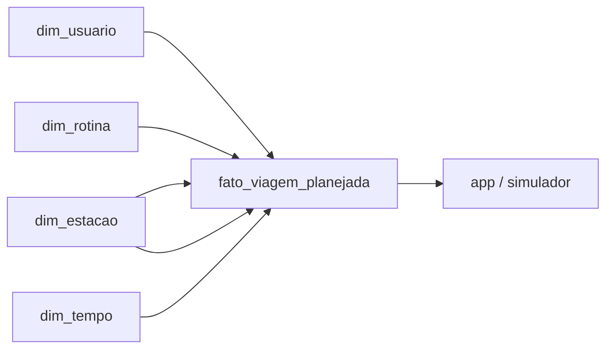

# Dados simulados da massa inicial

## Sumário

1. Objetivo
2. Fontes e limites
3. Granularidade por tabela
4. Chaves e relacionamentos
5. Premissas de horários e duração
6. Dicionário resumido de campos
7. Diagrama Mermaid
8. Como gerar os arquivos
9. Como são consumidos pelo app
10. Validações executadas e pendências
11. Cenários e dados da sessão

## 1. Objetivo

Este conjunto de dados fictícios foi criado para apoiar a demonstração do MVP de mobilidade inclusiva da Linha 7–Rubi. A massa inicial representa seis usuários, oito rotinas e dezesseis trechos planejados de viagem em uma modelagem dimensional simples em estrela.

O objetivo principal é demonstrar como o aplicativo pode relacionar perfil do passageiro, rotina recorrente, origem/destino e assistência planejada sem afirmar que qualquer atendimento ou acesso foi confirmado por uma operadora real.

## 2. Fontes e limites

- O cadastro de estações em [data/estacoes_linha7.csv](../data/estacoes_linha7.csv) é a base real adotada para a Linha 7–Rubi.
- Todas as demais informações neste conjunto são sintéticas e fictícias.
- Não há autenticação real, cadastro de pessoas reais, nem dados de atendimento oficial.
- As necessidades de apoio são campos explícitos e não são inferidas automaticamente por gênero ou deficiência.

## 3. Granularidade por tabela

### dim_usuario

Uma linha representa um usuário fictício. Os campos com dados pessoais foram definidos de forma controlada e deliberadamente sintética, com atenção para manter idade, nascimento e endereço coerentes no contexto do projeto.

### dim_tempo

Uma linha representa um horário do dia usado na massa inicial. A dimensão não classifica ocorrência ou pico; apenas armazena o horário e a subdivisão do dia.

### dim_rotina

Uma linha representa uma rotina recorrente do usuário. Cada rotina tem dias ativos, objetivo e status de ativação.

### fato_viagem_planejada

Uma linha representa um trecho planejado de uma rotina: ida ou volta, e não ambos ao mesmo tempo. Todas as viagens seguem a regra de origem e destino diferentes, com retorno invertido e programado após a chegada.

### dim_ocorrencia

Uma linha representa uma hora do dia de referência, 01/09/2026 (terça-feira), com status operacional, nível de movimento e impacto para os usuários. A tabela apoia a apresentação do MVP; não representa uma série histórica observada.

### dim_estacao

A dimensão de estações foi derivada do cadastro real, sem criar uma segunda lista divergente. Cada linha representa uma estação da Linha 7–Rubi e mantém a referência à fonte oficial.

## 4. Chaves e relacionamentos

- dim_usuario: chave primária = usuario_id
- dim_tempo: chave primária = tempo_id
- dim_rotina: chave primária = rotina_id
- dim_estacao: chave primária = estacao_id
- fato_viagem_planejada: chave primária = viagem_planejada_id
- dim_ocorrencia: chave primária = ocorrencia_id

Relacionamentos:

- fato_viagem_planejada.usuario_id -> dim_usuario.usuario_id
- fato_viagem_planejada.rotina_id -> dim_rotina.rotina_id
- fato_viagem_planejada.estacao_origem_id -> dim_estacao.estacao_id
- fato_viagem_planejada.estacao_destino_id -> dim_estacao.estacao_id
- fato_viagem_planejada.tempo_saida_id -> dim_tempo.tempo_id
- fato_viagem_planejada.tempo_chegada_id -> dim_tempo.tempo_id
- dim_ocorrencia: tabela complementar de operação e condições do dia, consumida pela interface para contextualizar o cenário.

## 5. Premissas de horários e duração

- A data de referência da idade é 2026-01-15.
- O cenário operacional usa 2026-09-01, terça-feira. A referência anterior a segunda-feira era um erro documental; a data dos registros foi preservada.
- A simulação considera operação entre 4h e 23h, com fechamento de 0h a 3h. Essa é uma premissa do conjunto existente, não uma consulta ao horário oficial atual.
- Às 6h, 7h e 8h, a movimentação foi modelada como pico matinal; às 9h, 10h e 11h, como baixo movimento. O app lê o valor de cada hora do CSV.
- Às 13h, foi inserida uma simulação de queda de energia em estações selecionadas para refletir um problema operacional plausível e relevante para as rotinas do dia.
- As demais faixas foram distribuídas para manter coerência com horários de trabalho, estudo, almoço e retorno para casa.
- A duração planejada foi calculada a partir da diferença entre saída e chegada, sem sortear valores inconsistentes.
- Nenhum trecho atravessa madrugada na massa inicial.
- O retorno sempre ocorre após a chegada da ida e conserva o sentido oposto.
- assistencia_prevista indica intenção de solicitar apoio e não confirmação de atendimento.

## 6. Dicionário resumido de campos

### dim_usuario

- usuario_id: identificador estável do usuário
- nome: nome fictício
- idade_referencia: idade calculada em data de referência fixa
- data_referencia_idade: data usada para cálculo da idade
- sexo: valor controlado, por exemplo masculino ou feminino
- data_nascimento: data de nascimento sintética em ISO
- cpf: texto sintético do tipo CPF_TESTE_001
- endereco_logradouro, endereco_numero, endereco_complemento, endereco_bairro, endereco_municipio, endereco_uf, endereco_cep: dados do endereço fictício
- deficiencia_informada: campo explícito, sem diagnóstico médico
- usa_cadeira_rodas: booleano
- preferencia_comunicacao: canal preferencial para comunicação
- necessita_percurso_sem_escadas: booleano
- prefere_orientacao_embarque: booleano
- solicita_acompanhamento: booleano
- dados_sinteticos: identificador do registro artificial

### dim_tempo

- tempo_id: identificador do horário
- horario: HH:MM
- hora: inteiro da hora
- minuto: inteiro do minuto
- periodo_dia: manhã, tarde ou noite

### dim_rotina

- rotina_id: identificador da rotina
- nome_rotina: nome descritivo
- objetivo: trabalho, estudo, lazer ou compromisso_pessoal
- dias da semana: booleanos
- ativa: booleano
- dados_sinteticos: identificador do registro artificial

### fato_viagem_planejada

- viagem_planejada_id: identificador do trecho
- usuario_id, rotina_id
- sentido: ida ou volta
- estacao_origem_id, estacao_destino_id
- tempo_saida_id, tempo_chegada_id
- chegada_dia_offset: 0 ou 1, conforme cronologia
- duracao_planejada_minutos
- antecedencia_assistencia_minutos
- assistencia_prevista
- dados_sinteticos

### dim_ocorrencia

- ocorrencia_id: identificador do registro horário
- data: data do cenário em ISO
- hora: inteiro de 0 a 23
- horario: HH:00 em formato texto
- status_operacao: fechado, operacao_inicial, normal ou restricao_operacional
- movimento: sem_servico, baixo, moderado ou alto
- estacoes_afetadas: texto das estações afetadas
- descricao: resumo do cenário
- impacto_usuarios: efeito relevante para o passageiro
- dados_sinteticos

## 7. Diagrama Mermaid



## 8. Como gerar os arquivos

A partir da raiz do repositório, execute:

```bash
python data/simulados/generate_dados_sinteticos.py
```

O script gera os CSVs em [data/simulados](../data/simulados) e valida as regras mínimas antes de finalizar.

## 9. Como as rotinas alimentam o app

`app/src/data_access.py` liga o usuário às rotinas e aos trechos de ida e volta. A primeira ida é carregada na entrada; as demais rotinas e o retorno podem ser escolhidos na interface. O cenário inicial usa a hora da saída, agrupando os minutos na hora correspondente: 07:30 consulta o registro das 7h.

`app/src/journey.py` calcula o percurso pela ordem das estações e cruza os nomes das estações afetadas com esse percurso. O app não estima tempo de chegada nem usa as durações sintéticas como previsão validada. As necessidades de apoio são explícitas, e qualquer perfil pode fazer um pedido.

Os booleanos são convertidos de maneira explícita. A string `False` deve resultar em falso; usar `bool("False")` produziria um resultado incorreto.

## 10. Validações executadas e pendências

Validações executadas:

- exatamente seis usuários e nomes esperados;
- chaves primárias e estrangeiras consistentes;
- idade coerente com nascimento e data de referência;
- CPFs sintéticos e distintos;
- 8 rotinas com pelo menos um dia ativo;
- 16 trechos com ida e volta por rotina;
- origem e destino invertidos corretamente no retorno;
- estações pertencentes ao cadastro real;
- campos sintéticos validados;
- nenhuma assistência tratada como confirmada.

Na revisão de 25/09/2026, foi acrescentado `TMP-1830` (18:30) a `dim_tempo.csv` e ao gerador. Esse horário já era referenciado pela chegada de retorno do Lucas, mas faltava na dimensão. A tabela passou a conter 15 horários, sem alteração das viagens ou das chaves existentes. O gerador passou a validar os horários de saída e chegada de todos os trechos, além das referências a usuário e rotina.

As seis tabelas foram regeneradas em diretório temporário e comparadas, registro a registro, aos CSVs versionados. A reprodução não altera o cadastro real. Testes de domínio e do Streamlit estão em `tests/`.

Limitações: as durações foram escolhidas para a narrativa e não calibradas com observações; integrações do cadastro podem demandar revisão de vigência; a data de consulta da dimensão de estações é uma referência fixa do gerador e não comprova atualização recente da fonte.

## 11. Cenários e dados da sessão

### 11.1 Quatro cenários determinísticos

| Identificador | Hora | Origem dos dados | Objetivo |
|---|---|---|---|
| `tranquilo` | 10h | Registro das 10h | Mostrar baixo movimento sem ocorrência. |
| `moderado` | 14h | Registro das 14h | Mostrar movimento moderado sem ocorrência. |
| `pico` | 7h | Registro das 7h | Mostrar o efeito do movimento alto. |
| `ocorrencia` | 7h | Restrição das 13h combinada com movimento alto | Comparar o mesmo horário com uma ocorrência. |

O modo adicional `horario` consulta diretamente qualquer uma das 24 horas. A seleção da cena não regrava os CSVs. A sobreposição preserva as estações da ocorrência existente: Vila Aurora, Perus e Caieiras. Não se simula falha de elevador, pois o cadastro não confirma esse equipamento.

### 11.2 Perfil e rotina temporários

Um novo perfil usa `usuario_id=USR-DEMO`, nome de teste, comunicação por texto e necessidades escolhidas explicitamente. Não são gerados CPF, endereço, nascimento ou credenciais. Edições dos perfis existentes conservam seu identificador e ficam somente na memória da sessão.

A rotina adicional usa `rotina_id=ROT-SESSAO`; uma linha lógica representa a rotina com dois trechos (`legs.ida` e `legs.volta`). Os campos são objetivo/nome (texto), dias (lista de Seg a Dom), origem e destino (IDs de `dim_estacao`) e saída (texto `HH:MM`). O retorno inverte as estações e deve ocorrer após a saída no mesmo dia. Não há estimativa de chegada. Salvar novamente substitui apenas essa rotina temporária.

### 11.3 Solicitação de assistência

Cada objeto representa um pedido na sessão, com esta estrutura:

| Campo | Tipo e regra |
|---|---|
| `id` | Texto sequencial local, como `DEMO-001`; não é protocolo da operadora. |
| `context` | Tupla com usuário, origem, destino e cenário/hora. |
| `status` | `pendente`, `confirmado`, `concluido` ou `cancelado`. |
| `support` | Lista de tipos de apoio selecionados. |
| `note` | Texto opcional, limitado a 240 caracteres. |
| `origin`, `destination` | Identificadores do cadastro de estações. |
| `hour` | Hora simulada no formato `HH:00`. |
| `staff`, `meeting` | Nulos no pedido pendente; textos explicitamente fictícios após confirmação. |
| `history` | Lista das etapas percorridas pelo pedido. |

O pedido começa pendente. Somente a ação do apresentador pode confirmar; somente um pedido confirmado pode ser concluído. Pedidos pendentes ou confirmados podem ser cancelados. O mesmo contexto ativo não cria pedido duplicado. O horário fechado impede um novo pedido.

Ao alterar viagem, cenário, hora ou preferências, o pedido anterior é removido e a interface informa a necessidade de nova solicitação. Reiniciar ou trocar a pessoa limpa as alterações, a rotina adicional e os pedidos; as preferências de leitura são preservadas. Nada é escrito nos CSVs nem enviado à operadora.
