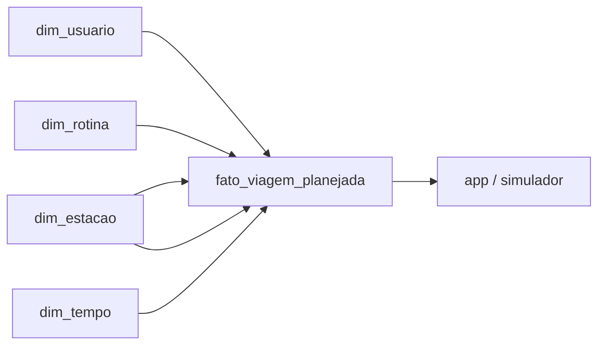

# Dados simulados da massa inicial

## Sumário

1. Objetivo
2. Fontes e limites
3. Granularidade por tabela
4. Chaves e relacionamentos
5. Premissas de horários e duração
6. Dicionário resumido de campos
7. Diagrama Mermaid
8. Como gerar os arquivos
9. Como serão consumidos pelo app
10. Validações executadas e pendências

## 1. Objetivo

Este conjunto de dados fictícios foi criado para apoiar a demonstração do MVP de mobilidade inclusiva da Linha 7–Rubi. A massa inicial representa seis usuários, oito rotinas e dezesseis trechos planejados de viagem em uma modelagem dimensional simples em estrela.

O objetivo principal é demonstrar como o aplicativo pode relacionar perfil do passageiro, rotina recorrente, origem/destino e assistência planejada sem afirmar que qualquer atendimento ou acesso foi confirmado por uma operadora real.

## 2. Fontes e limites

- O cadastro de estações em [data/estacoes_linha7.csv](../data/estacoes_linha7.csv) é a base real adotada para a Linha 7–Rubi.
- Todas as demais informações neste conjunto são sintéticas e fictícias.
- Não há autenticação real, cadastro de pessoas reais, nem dados de atendimento oficial.
- As necessidades de apoio são campos explícitos e não são inferidas automaticamente por gênero ou deficiência.

## 3. Granularidade por tabela

### dim_usuario

Uma linha representa um usuário fictício. Os campos com dados pessoais foram definidos de forma controlada e deliberadamente sintética, com atenção para manter idade, nascimento e endereço coerentes no contexto do projeto.

### dim_tempo

Uma linha representa um horário do dia usado na massa inicial. A dimensão não classifica ocorrência ou pico; apenas armazena o horário e a subdivisão do dia.

### dim_rotina

Uma linha representa uma rotina recorrente do usuário. Cada rotina tem dias ativos, objetivo e status de ativação.

### fato_viagem_planejada

Uma linha representa um trecho planejado de uma rotina: ida ou volta, e não ambos ao mesmo tempo. Todas as viagens seguem a regra de origem e destino diferentes, com retorno invertido e programado após a chegada.

### dim_ocorrencia

Uma linha representa uma hora do dia em uma segunda-feira específica, com status operacional, nível de movimento e impacto para os usuários. A tabela foi criada para apoiar a apresentação do MVP e para contextualizar quando a linha está fechada, em pico ou com restrição localizada.

### dim_estacao

A dimensão de estações foi derivada do cadastro real, sem criar uma segunda lista divergente. Cada linha representa uma estação da Linha 7–Rubi e mantém a referência à fonte oficial.

## 4. Chaves e relacionamentos

- dim_usuario: chave primária = usuario_id
- dim_tempo: chave primária = tempo_id
- dim_rotina: chave primária = rotina_id
- dim_estacao: chave primária = estacao_id
- fato_viagem_planejada: chave primária = viagem_planejada_id
- dim_ocorrencia: chave primária = ocorrencia_id

Relacionamentos:

- fato_viagem_planejada.usuario_id -> dim_usuario.usuario_id
- fato_viagem_planejada.rotina_id -> dim_rotina.rotina_id
- fato_viagem_planejada.estacao_origem_id -> dim_estacao.estacao_id
- fato_viagem_planejada.estacao_destino_id -> dim_estacao.estacao_id
- fato_viagem_planejada.tempo_saida_id -> dim_tempo.tempo_id
- fato_viagem_planejada.tempo_chegada_id -> dim_tempo.tempo_id
- dim_ocorrencia: tabela complementar de operação e condições do dia, consumida pela interface para contextualizar o cenário.

## 5. Premissas de horários e duração

- A data de referência da idade é 2026-01-15.
- O cenário operacional de 24 horas foi definido para a segunda-feira, 2026-09-01, conforme a pergunta da apresentação do projeto.
- A linha opera diariamente das 4h à meia-noite, conforme a fonte oficial da TIC Trens; por isso, os horários fora desse intervalo foram marcados como fechado.
- Entre 06h e 09h, a movimentação foi modelada como pico matinal, com maior concentração de passageiros nas estações centrais e de trabalho.
- Entre 09h e 12h, o movimento foi reduzido para um cenário de operação normal e baixo fluxo.
- Às 13h, foi inserida uma simulação de queda de energia em estações selecionadas para refletir um problema operacional plausível e relevante para as rotinas do dia.
- As demais faixas foram distribuídas para manter coerência com horários de trabalho, estudo, almoço e retorno para casa.
- A duração planejada foi calculada a partir da diferença entre saída e chegada, sem sortear valores inconsistentes.
- Nenhum trecho atravessa madrugada na massa inicial.
- O retorno sempre ocorre após a chegada da ida e conserva o sentido oposto.
- assistencia_prevista indica intenção de solicitar apoio e não confirmação de atendimento.

## 6. Dicionário resumido de campos

### dim_usuario

- usuario_id: identificador estável do usuário
- nome: nome fictício
- idade_referencia: idade calculada em data de referência fixa
- data_referencia_idade: data usada para cálculo da idade
- sexo: valor controlado, por exemplo masculino ou feminino
- data_nascimento: data de nascimento sintética em ISO
- cpf: texto sintético do tipo CPF_TESTE_001
- endereco_logradouro, endereco_numero, endereco_complemento, endereco_bairro, endereco_municipio, endereco_uf, endereco_cep: dados do endereço fictício
- deficiencia_informada: campo explícito, sem diagnóstico médico
- usa_cadeira_rodas: booleano
- preferencia_comunicacao: canal preferencial para comunicação
- necessita_percurso_sem_escadas: booleano
- prefere_orientacao_embarque: booleano
- solicita_acompanhamento: booleano
- dados_sinteticos: identificador do registro artificial

### dim_tempo

- tempo_id: identificador do horário
- horario: HH:MM
- hora: inteiro da hora
- minuto: inteiro do minuto
- periodo_dia: manhã, tarde ou noite

### dim_rotina

- rotina_id: identificador da rotina
- nome_rotina: nome descritivo
- objetivo: trabalho, estudo, lazer ou compromisso_pessoal
- dias da semana: booleanos
- ativa: booleano
- dados_sinteticos: identificador do registro artificial

### fato_viagem_planejada

- viagem_planejada_id: identificador do trecho
- usuario_id, rotina_id
- sentido: ida ou volta
- estacao_origem_id, estacao_destino_id
- tempo_saida_id, tempo_chegada_id
- chegada_dia_offset: 0 ou 1, conforme cronologia
- duracao_planejada_minutos
- antecedencia_assistencia_minutos
- assistencia_prevista
- dados_sinteticos

### dim_ocorrencia

- ocorrencia_id: identificador do registro horário
- data: data do cenário em ISO
- hora: inteiro de 0 a 23
- horario: HH:00 em formato texto
- status_operacao: fechado, operacao_inicial, normal ou restricao_operacional
- movimento: sem_servico, baixo, moderado ou alto
- estacoes_afetadas: texto das estações afetadas
- descricao: resumo do cenário
- impacto_usuarios: efeito relevante para o passageiro
- dados_sinteticos

## 7. Diagrama Mermaid



## 8. Como gerar os arquivos

A partir da raiz do repositório, execute:

```bash
python data/simulados/generate_dados_sinteticos.py
```

O script gera os CSVs em [data/simulados](../data/simulados) e valida as regras mínimas antes de finalizar.

## 9. Como as rotinas alimentarão o app

Esses dados serão usados em duas camadas futuras:

1. perfil do passageiro e contexto do dia a dia;
2. cálculo dos deslocamentos e planejamento de assistência.

A ideia é manter a rotina como referência para explicar a decisão do usuário e para relacionar demandas de acessibilidade com o cenário operacional, sem transformar a simulação em dado oficial.

## 10. Validações executadas e pendências

Validações executadas:

- exatamente seis usuários e nomes esperados;
- chaves primárias e estrangeiras consistentes;
- idade coerente com nascimento e data de referência;
- CPFs sintéticos e distintos;
- 8 rotinas com pelo menos um dia ativo;
- 16 trechos com ida e volta por rotina;
- origem e destino invertidos corretamente no retorno;
- estações pertencentes ao cadastro real;
- campos sintéticos validados;
- nenhuma assistência tratada como confirmada.

Pendências:

- o simulador operacional ainda não foi implementado;
- a interface e os cenários de ocorrência ficam para etapas futuras;
- novos dados de ocorrências e eventos não foram incluídos nesta massa inicial.
